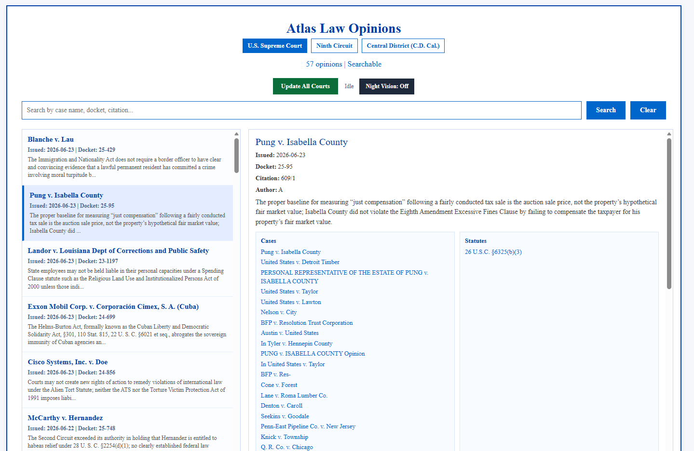
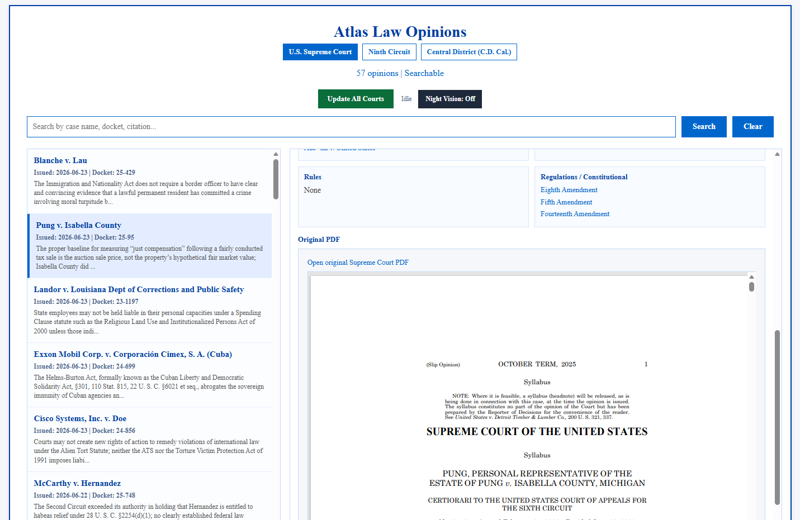
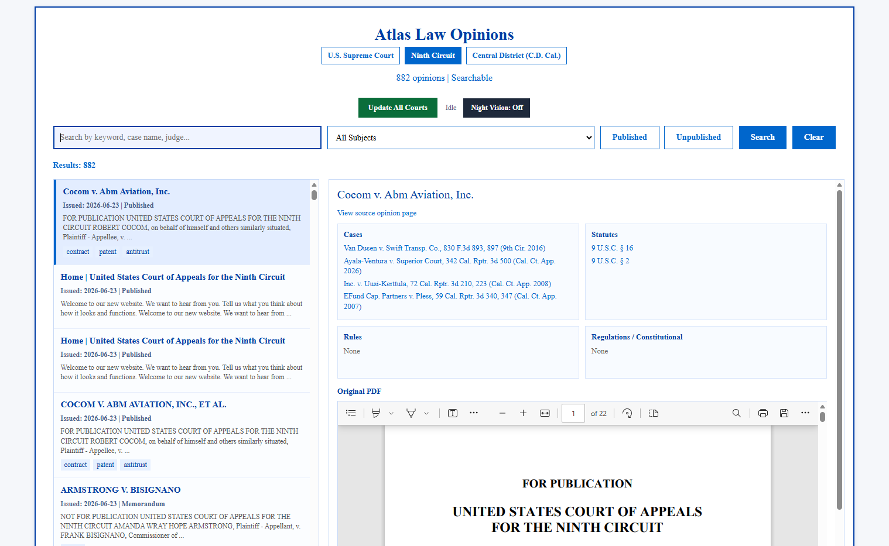
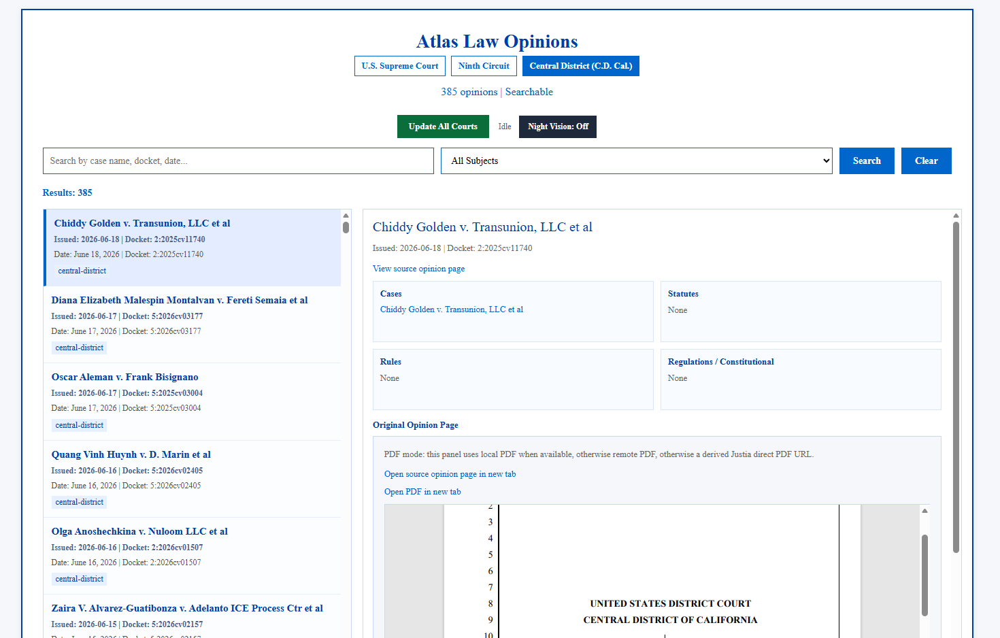

# Atlas Law Viewer

A local-first tool for searching and reading recent federal court opinions from the
U.S. Supreme Court, the Ninth Circuit, and the Central District of California. It pulls
opinions from each court, extracts text and citations, stores them locally, and serves a
searchable browser interface, all running on your own machine with no account, no API
key, and no user data sent to a third-party service.

Built for people who need quick access to recent opinions but don't have a paid legal
research subscription — pro se litigants and small firms in particular.

## What It Does
- Pulls and serves searchable opinions from three courts: U.S. Supreme Court, Ninth Circuit,
   and Central District of California (C.D. Cal.).
- Gives each court its own searchable page with an opinion detail panel.
- Extracts the authorities each opinion cites (cases, statutes, rules, regulations) and
  links them to free legal sources.
- Renders opinion PDFs, served from a local cache when available and proxied from the
  source court when not.
- Runs as a small local web server that only serves an explicit allowlist of files, so it
   cannot accidentally expose the rest of your disk.

## How It Works
The project has two halves:

1. **Ingestion** — one script per court fetches the court's opinion list, downloads each
   opinion, extracts text (from PDF or HTML), pulls citations, and writes the results to a
   local SQLite database and JSON files. A refresh script (`atlas_daily_refresh.ps1`) runs
   all three in sequence, with per-step logging and before/after counts.
2. **Serving** — `atlas_law_server.py` reads the generated data and serves the searchable
   pages locally at `http://127.0.0.1:8080/`.

The ingestion layer is the fragile part: it depends on each court's website structure. When
the Ninth Circuit changed its site layout, the original scrape broke, and I added a
CourtListener-based path to recover the missing opinions. The serving layer has stayed
stable throughout.

## Local URLs
- Home: `http://127.0.0.1:8080/`
- U.S. Supreme Court: `http://127.0.0.1:8080/supreme_opinions_index.html`
- Ninth Circuit: `http://127.0.0.1:8080/opinions_index.html`
- Central District (C.D. Cal.): `http://127.0.0.1:8080/central_opinions_index.html`

## Tech Stack
- Python 3.10+
- `requests`, `beautifulsoup4`, `lxml` — fetching and parsing court pages
- `PyMuPDF` (fitz) and `PyPDF2` — extracting text from opinion PDFs
- `cloudscraper` — fetching from sources that block plain requests
- Python's built-in `http.server` — the local server (no web framework)
- Static HTML + JSON for the generated views
- PowerShell + CMD scripts for launching and refreshing (Windows)

## Quick Start
No accounts or API keys required.

1. Create and activate a virtual environment.
2. Install dependencies: `pip install -r requirements.txt`
3. Start the app (Windows):
   - Double-click `launch_atlas_standard.cmd`, or
   - run: `powershell -ExecutionPolicy Bypass -File .\start_atlas_server.ps1`
4. Open `http://127.0.0.1:8080/` in your browser.

Alternative start method:
- `python atlas_law_server.py`

To pull fresh opinions, run the refresh pipeline (`atlas_daily_refresh.ps1`) or use the
"Update All Courts" button in the interface.

## Repo Layout
- `atlas_law_server.py` — local server with an allowlist and API endpoints (PDF serving, citation resolver, refresh control)
- `atlas_law_v1.py` — Ninth Circuit ingestion; also triggers the Ninth viewer build
- `atlas_law_viewer.py` — builds the Ninth Circuit searchable page from the database
- `supreme_court_viewer.py` — Supreme Court ingestion, authority extraction, and viewer build
- `central_district_viewer.py` — Central District ingestion and viewer build
- `atlas_daily_refresh.ps1` — runs all three court pipelines in sequence
- `start_atlas_server.ps1` / `launch_atlas_standard.cmd` — launchers
- `opinions_*.html`, `*_opinions_*.json` — generated search pages and datasets

## Notes for Reviewers
- The repository includes generated HTML and JSON snapshots so the search interface works
  immediately after cloning.
- The much larger PDF corpus and local SQLite database are excluded. Empty placeholder
  directories (`ninth_pdfs/`, `central_pdfs/`, `case_extractor/documents/`) keep the expected
  local cache structure in place.
- All generated snapshots and local caches can be refreshed from their public sources with
  the refresh script.
- Secrets and the local database are excluded via `.gitignore` and are not part of this repo.

## Data Sources and Attribution
Opinions are public records retrieved from each court's official source:

- U.S. Supreme Court — slip opinions from supremecourt.gov
- Ninth Circuit — opinions from ca9.uscourts.gov, with CourtListener (courtlistener.com) used as a fallback source
- Central District of California — opinions via Justia (law.justia.com)

This project stores and displays public-record opinions for research convenience. It does
not claim ownership of any opinion text, and it is not affiliated with or endorsed by any
court, CourtListener, or Justia.

## Known Limitations
- Ingestion depends on each court's website structure, so a court changing its site can break
  that court's scraper until it is updated.
- Updates are manual — opinions are only as current as the last refresh.
- Single-user and local-only by design: no authentication, no remote access, no multi-user support.
- Night Vision (dark mode) is stored per court in the browser, so the preference does not carry
  across the three court pages.

## Engineering Decisions
1. **Resilient ingestion over a single clean source.**
   Each court is scraped independently with graceful fallbacks, because court websites change
   and block requests without warning. When the Ninth Circuit changed its layout, the
   per-court design meant only that pipeline broke, and a fallback source recovered the gap.
   *Tradeoff:* data freshness depends on source availability and which path succeeds.

2. **Local-first over cloud.**
   The app runs as a local server with static HTML + JSON outputs. This keeps it free to run,
   private (no user data sent to a third-party service), and trivial to clone and demo.
   *Tradeoff:* single-user only, no remote access, and updates are manual rather than
   continuous — which is acceptable for a single-researcher tool.

3. **Allowlist server over generic file serving.**
   The server serves only an explicit list of approved files and rejects path-traversal
   attempts, so running it can't accidentally expose other files on disk.
   *Tradeoff:* adding a new page requires updating the allowlist rather than just dropping a
   file in the folder.

## Screenshots
### U.S. Supreme Court Search

### U.S. Supreme Court Opinion Detail

### Ninth Circuit Search

### Central District of California Search

## License
MIT License. See [LICENSE](LICENSE).
